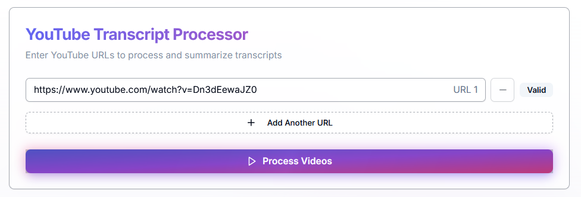
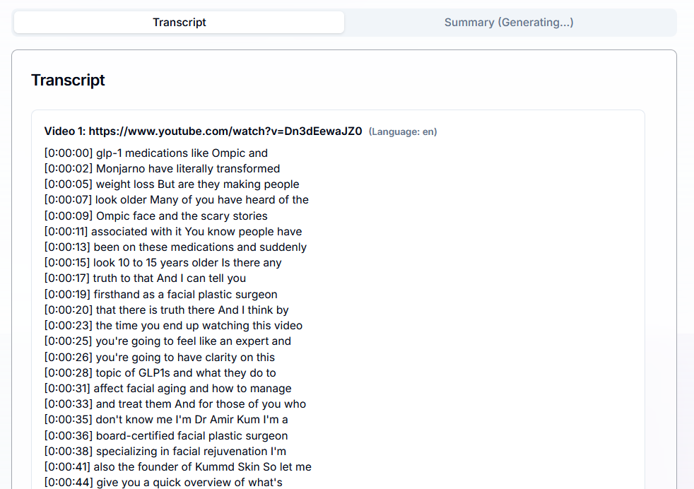
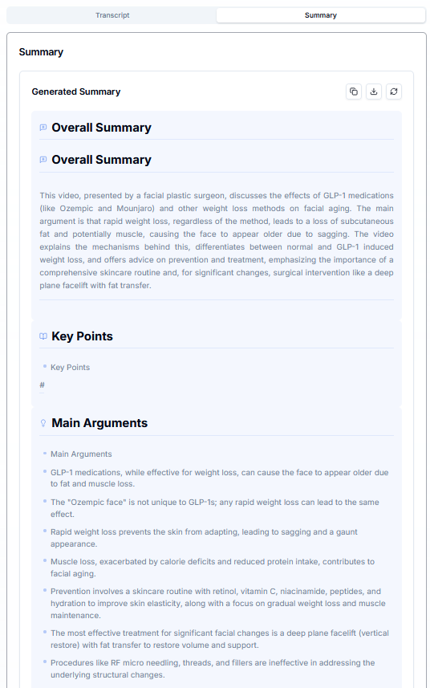
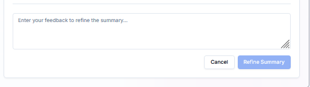

# YouTube Transcript Processor and Summarizer

This project consists of a Python backend and Next.js frontend for processing YouTube video transcripts and generating AI summaries.

## Project Structure

- `/frontend/my-app` - Next.js frontend application
- `/` - Python backend API

## Getting Started

### Backend

1. Install Python dependencies:

```bash
pip install -r requirements.txt
```

2. Run the backend server:

```bash
python main.py
```

The backend server will run on http://localhost:5000 by default.

### Frontend

1. Navigate to the frontend directory:

```bash
cd frontend/my-app
```

2. Install dependencies:

```bash
npm install
```

3. Run the development server:

```bash
npm run dev
```

The frontend will be available at http://localhost:3000.

## Features

- Process YouTube video transcripts
- Generate AI summaries of video content
- Display transcripts with timestamps
- Refine summaries with user feedback
- Support for multiple videos at once

## License

See the LICENSE file for details.

## Contributing

Contributions are welcome. Please open an issue or submit a pull request.

## 🌟 Features

- **Multi-Video Processing**: Process multiple YouTube videos simultaneously
- **Smart URL Validation**: Automatic validation of YouTube URLs
- **Structured Summaries**: Well-organized summaries with:
  - Overall summary
  - Key points
  - Notable quotes with timestamps
  - Speaker analysis
  - Main themes and insights
- **Interactive UI**: Clean, responsive interface with dark mode support
- **Refinement Options**: Ability to refine and customize summaries
- **Copy & Export**: Easy sharing of generated summaries

## 📸 Screenshots

### URL Input and Processing

*Enter YouTube URLs with real-time validation and processing status*

### Transcript View

*View timestamped transcripts with easy navigation*

### Summary Output

*Well-structured summary with key points and notable quotes*

### Refinement Options

*Customize and refine the generated summaries*

## 🛠️ Tech Stack

- **Frontend**:
  - Next.js 14
  - TypeScript
  - Tailwind CSS
  - shadcn/ui components
  - Lucide React icons

## 📖 Usage

1. Enter one or more YouTube URLs in the input fields
2. Click "Process Videos" to generate summaries
3. View the generated transcripts and summaries
4. Use the refinement options to customize the summary if needed
5. Copy or export the results

## 🎨 UI Components

- **URL Input**: Clean interface for managing multiple YouTube URLs
- **Transcript View**: Displays timestamped transcripts
- **Summary Output**: Well-formatted summary with sections
- **Refinement Panel**: Tools for customizing summaries

## 🙏 Acknowledgments

- Built with [Next.js](https://nextjs.org/)
- UI components from [shadcn/ui](https://ui.shadcn.com/)
- Icons from [Lucide](https://lucide.dev/)

# Additional entries to consider
.env.local
.env.development.local
.env.test.local
.env.production.local
.cursor/
.history/
*.log.*
.tmp/
temp/
tmp/